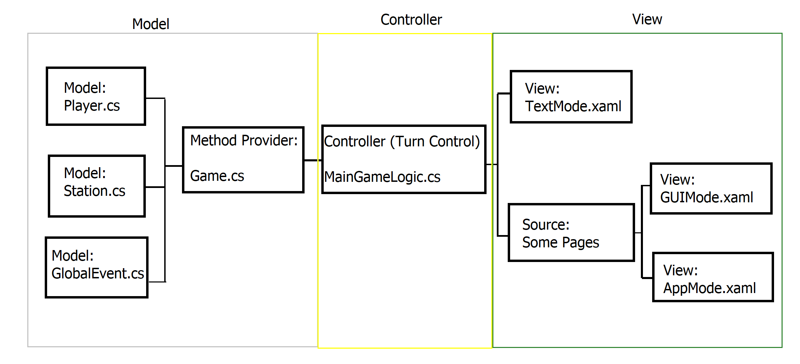
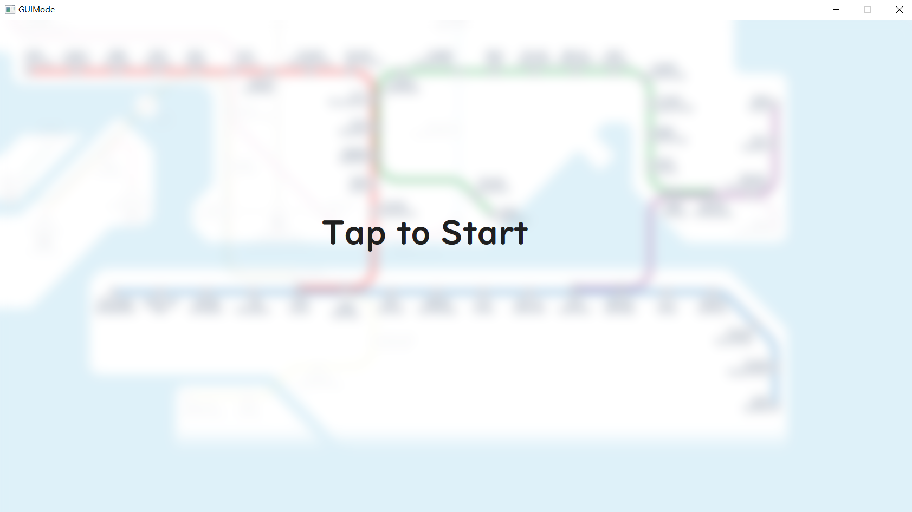
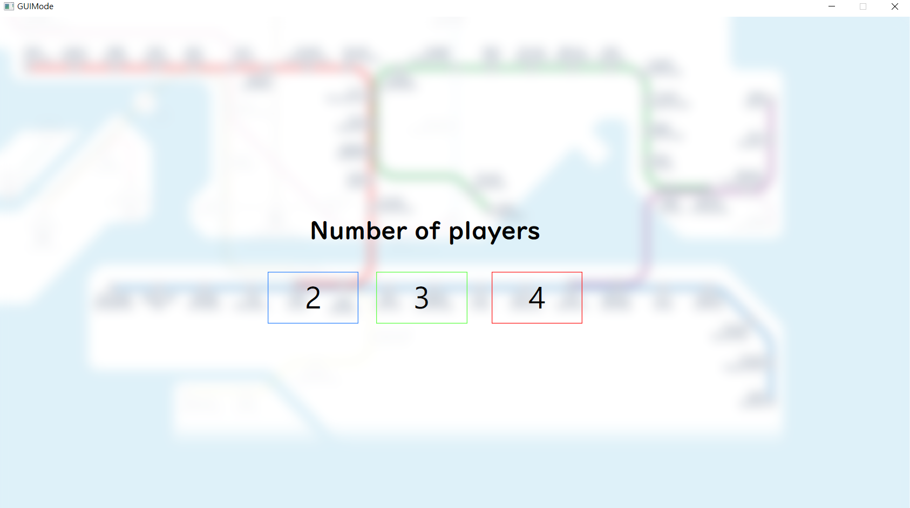
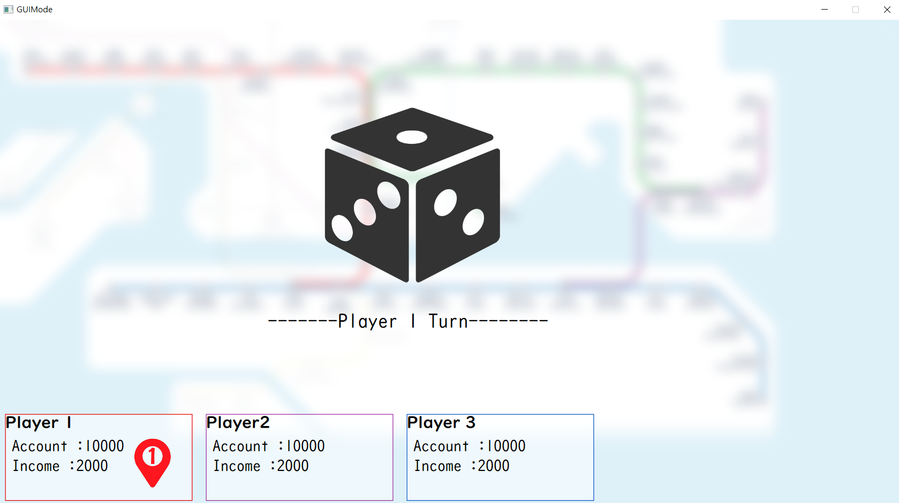
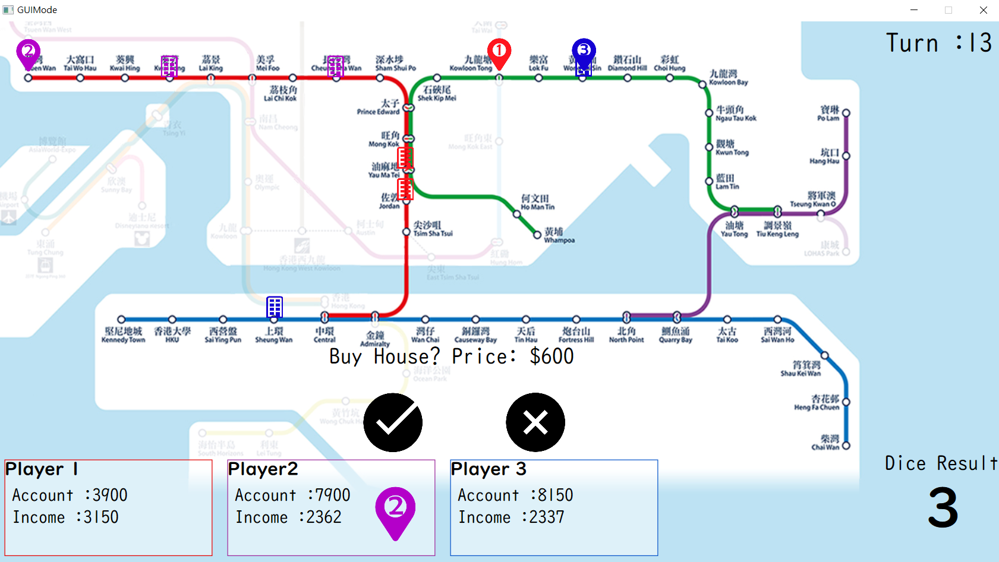
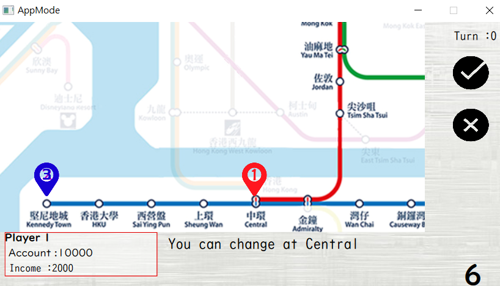
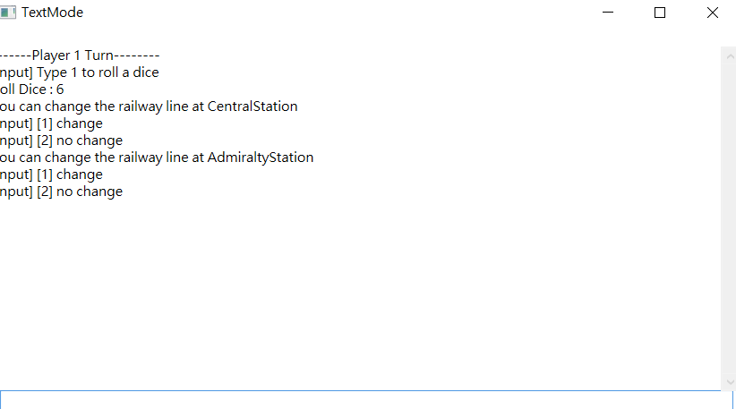

# HK-Monopoly

### Game Rules

Simple Monopoly game style with 2-4 players. The goal of the game is to survive until the last one by keeping your account balance more than $0. 
There are 3 ways to increase your account or income salary:

1.	Buy property to increase your income
2.	Earn the extra rent when other player step on your property
3.	[Once per player] Rob other’s property when you stepped on other player’s property Make good use of this chance to save you from failing or giving other player the lethal strike!

 Every turn, player need to roll a dice and go to the destination station. If there are any transition station in between, player can change the railway line and continue the remaining steps!

### Declaration
This report is prepared by the group of Ho Tung Lam and Lam Kai Chun for the course IERG3080 project part II. All the resources used in this project are for education purpose and internal used.

### Introduction

“HK Monopoly” is a game that based on the existing game “Monopoly” and redesigned some of the rules and implemented some new features inside. Different from the classic Monopoly, our game used the Hong Kong railway map instead of different sightseeing spots as our map, which allows player to enjoy a railway trip in Hong Kong when playing this game (And also the surprising event our MTR system has).

### Description

This project is written at C# language by Visual Studio. 

#### Structure:

#### Current created Mode:
-	GUI mode, App Mode and Text Mode

#### Class:
##### Model:
-	MainGameLogic.cs
-	Player.cs
-	Station.cs
-	Game.cs
-	GlobalEvent.cs

##### View:
- MainWindow.xaml.cs
- MainGame.xaml.cs
- App.xaml.cs
- AppMode.xaml.cs
- AppModeGameConsole.cs
- TestPage.xaml.cs
- TextMode.xaml.cs

### Screenshot
#### Start Page

#### Select the number of players

#### Dice rolling

#### Actual Game Play

#### App Mode (1/4 of Main Window size)

#### Text Mode

#### Synchronization of three mode

